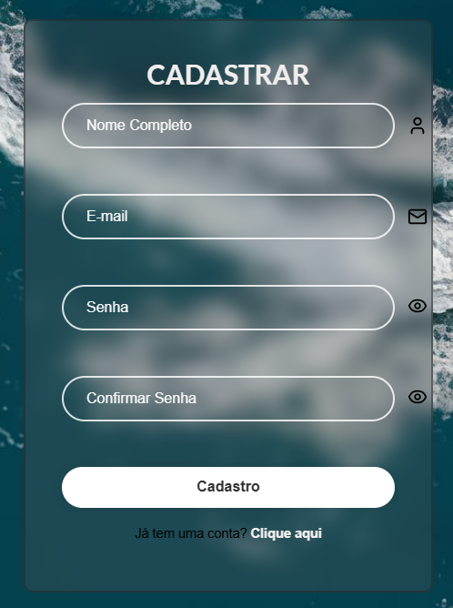
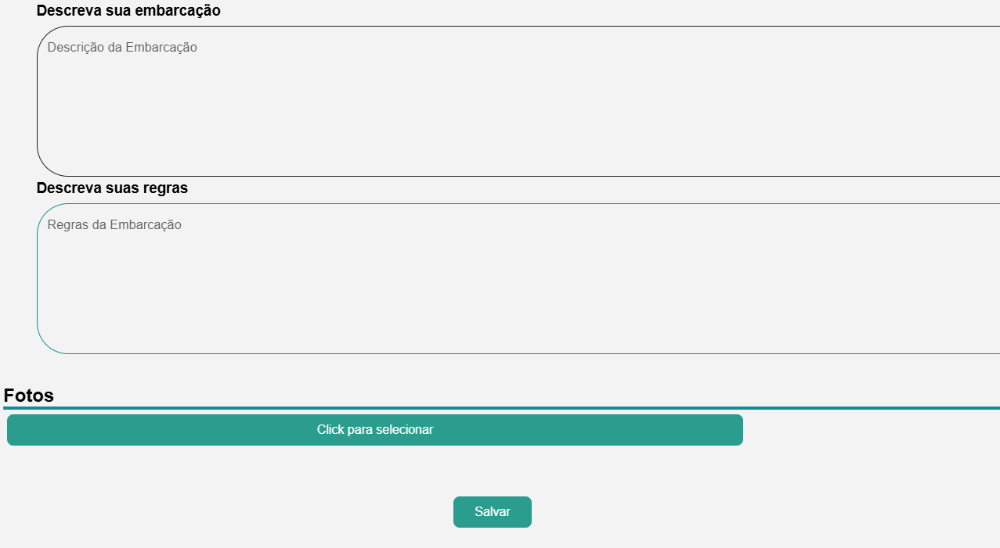
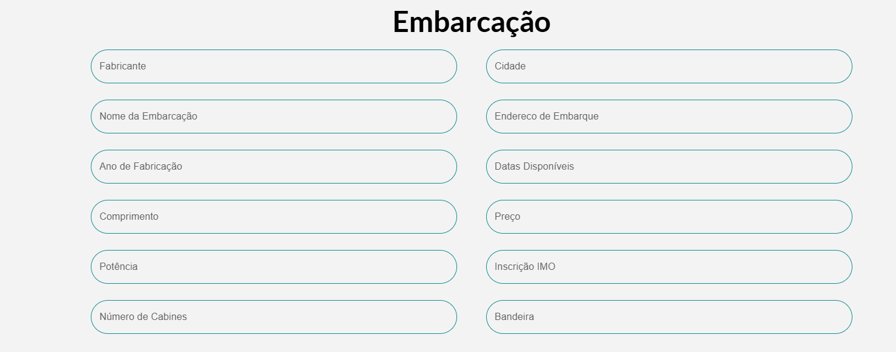
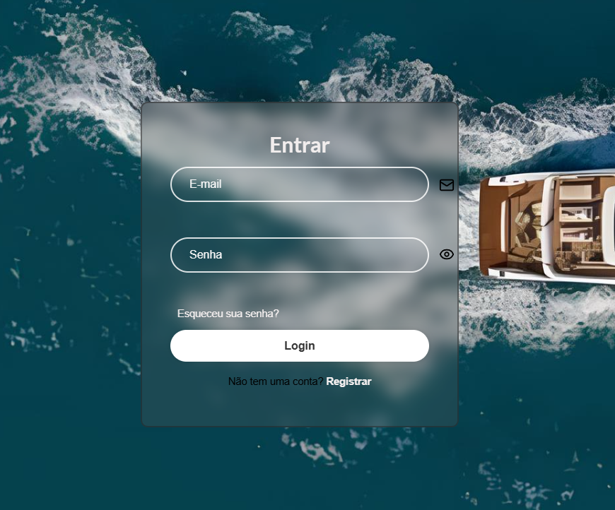
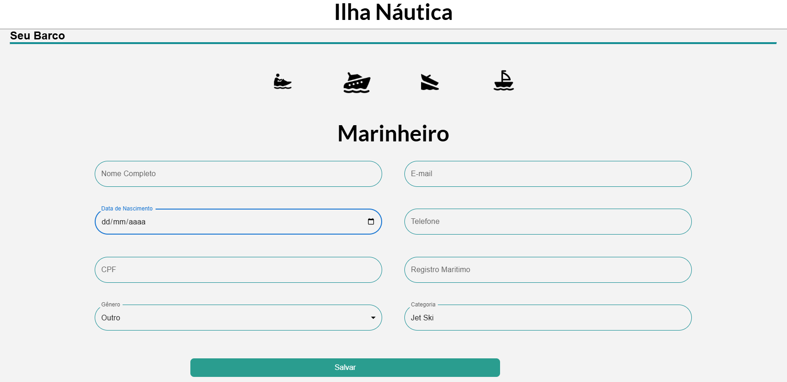
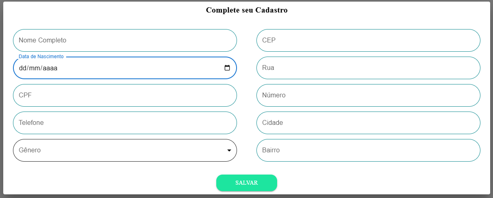
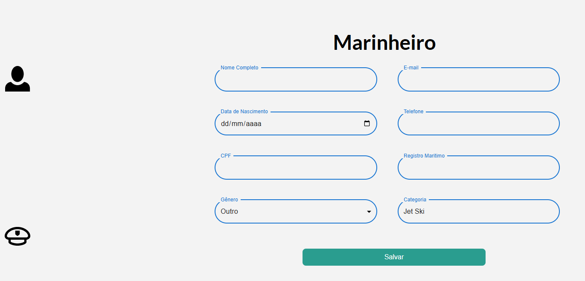
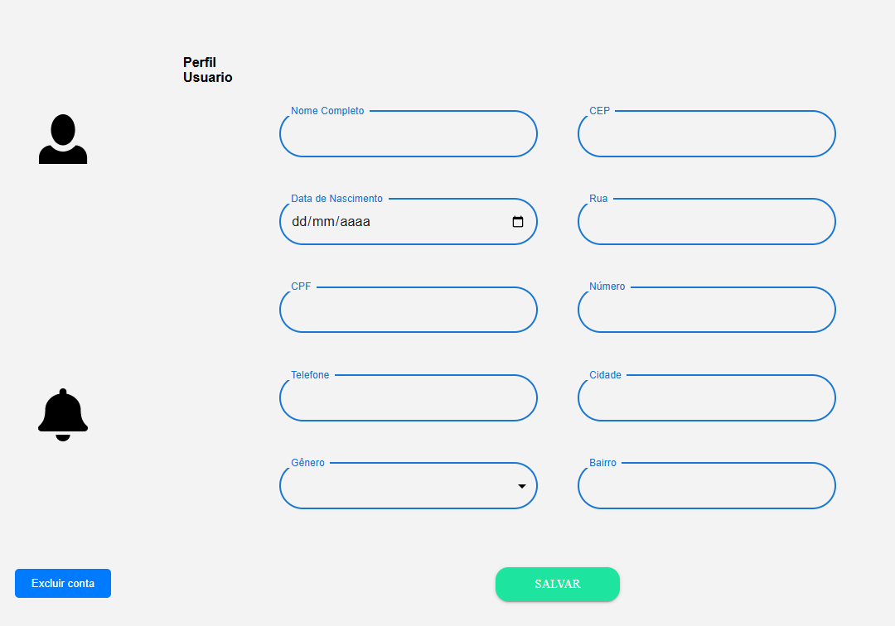
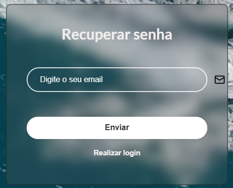

# ⛵ ILHA NAUTICA - Frontend 

O **Ilha NAUTICA**  é uma plataforma inovadora que automatiza o processo de aluguel de embarcações , proporcionando uma experiência prática e eficiente para locadores e locador. Este repositório contém o código-fonte do frontend, desenvolvido com **React.js** e integrado ao backend através de **Axios**.


---
## ✨ Funcionalidades Principais  

- **Interface Intuitiva**: Design responsivo e amigável para fácil navegação em diferentes dispositivos.  
- **Cadastro e Login**: Formulários interativos para criação de contas e autenticação de usuários.  
- **Agendamento Simplificado**: Busca por embarcações disponíveis com visualização de horários.  
- **Gerenciamento de Grupos**: Adicione e remova embarcações diretamente no sistema.

---

## 🛠️ Tecnologias Utilizadas  

- **React.js**: Biblioteca JavaScript para construção de interfaces de usuário.  
- **Axios**: Para realizar requisições HTTP ao backend.  
- **React Router**: Gerenciamento de rotas para navegação entre páginas.  
- **PostgreSQL**: Banco de dados para persistência e gerenciamento de dados, integrado ao backend.  
- **CSS Modules**: Para estilização modular e reutilizável.  

---
## Protótipos

cadastro

descrição

embarcação

login

marinheiro

modal

perfil

perfilUsuario

recuperaçãosenha



##
## 📋 Requisitos de Instalação  

- **Node.js** (versão 16 ou superior).  
- **npm** ou **yarn** para gerenciamento de pacotes.  
- Backend do projeto configurado e rodando.  

---


## 🚀 Configuração do Projeto  

1. Clone o repositório:  
   ```bash
   git clone https://github.com/RibeiroErick2024/IlhaNauticaV2FrontEnd.git
   
   ```

2. Instale as dependências:  
   ```bash
   npm install
   ```  
   ou  
   ```bash
   yarn install
   ```

3. Configure o arquivo `.env` para apontar ao backend:  
   ```env
   REACT_APP_API_BASE_URL=http://localhost:8080
   ```

4. Inicie o servidor de desenvolvimento:  
   ```bash
   npm start
   ```  
   ou  
   ```bash
   yarn start
   ```  

5. Acesse a aplicação no navegador:  
   ```plaintext
   http://localhost:3000
   ```

---

## 🗂️ Estrutura de Pastas  

```
src/
├── components/     # Componentes reutilizáveis da aplicação
├── config/         # Configuração de requisições Axios
├── pages/          # Páginas principais do sistema        
├── styles/         # Estilos globais e módulos CSS
├── utils/          # Funções auxiliares e constantes
├── App.js          # Componente principal


```

---

## 📜 Scripts Disponíveis  

- **`npm start`** ou **`yarn start`**: Inicia o servidor de desenvolvimento.  
- **`npm run build`** ou **`yarn build`**: Cria a build de produção.  
- **`npm test`** ou **`yarn test`**: Executa os testes disponíveis (se configurados).  

---

## 🔗 Comunicação com o Backend  

A comunicação entre o frontend e o backend é feita via **Axios**, utilizando o endpoint configurado no `.env`. Exemplos de requisições incluem:  

- **Login**: `POST /auth/login`  
- **Cadastro**: `POST /usuarios`  
- **Reservas**: `GET /reservas`  
- **Cancelamento**: `DELETE /reservas/{id}`  

---

## 🤝 Contribuição  

Contribuições são sempre bem-vindas! Para colaborar:  

1. Faça um fork do repositório.  
2. Crie uma nova branch:  
   ```bash
   git checkout -b minha-feature
   ```  
3. Envie suas alterações:  
   ```bash
   git push origin minha-feature
   ```  
4. Abra um Pull Request descrevendo suas alterações.  

---

## 👨‍💻 Autor  

O frontend do **ILHA NAUTICA** foi projetado para oferecer uma experiência fluida e eficiente na organização de alugueis de embarcação.  

---

## 📄 Licença  

Este projeto é licenciado sob a [MIT License](LICENSE).
